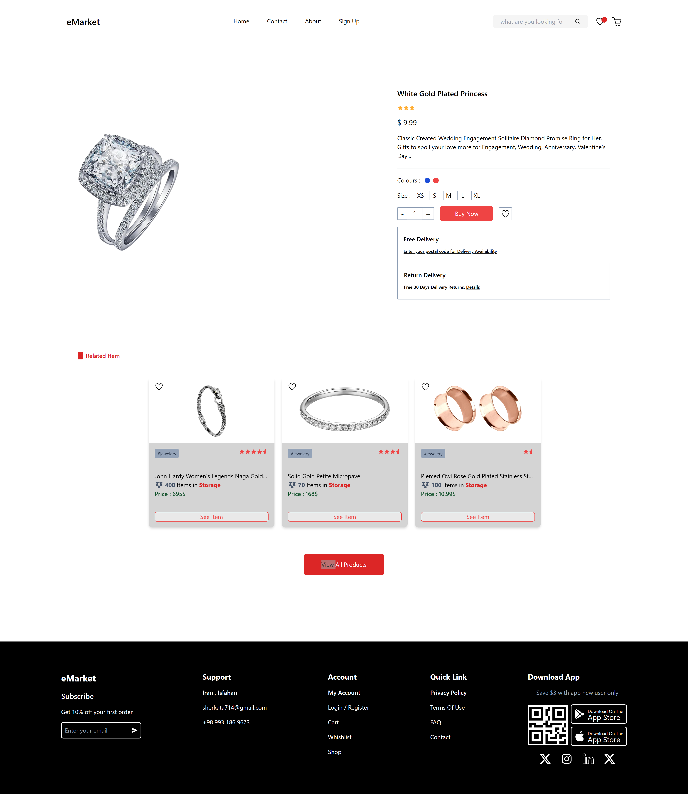

# eMarket

An e-commerce frontend project built with React.js.

The project is currently under development and is not complete yet. I am using it to work on different parts of a typical e-commerce application, including product browsing, product details, cart functionality, authentication-related flows, and order management.

## Tech Stack

* React.js
* JavaScript
* Vite
* React Router
* Axios
* Tailwind CSS
* Ant Design
* Fake Store API

## API

The project currently uses the [Fake Store API](https://fakestoreapi.com/) as the data source for products and related application data.

API requests are handled through Axios and are separated from the UI components where applicable.

## Project Structure

The source code is organized into separate areas based on their responsibilities:

```text
src/
├── assets/        # Static assets
├── components/    # Reusable UI components
├── hooks/         # Custom React hooks
├── layouts/       # Shared page layouts
├── pages/         # Application pages
├── services/      # API requests and related services
└── ...
```

The project structure may change as development continues and new parts of the application are added.

## Screenshots

### Home Page


### Product Info



## Current Scope

The current implementation includes work around:

* Product listing
* Product details
* Product categories
* Search and filtering
* Shopping cart
* Wishlist
* User-related pages and flows
* Order-related functionality
* Reusable components
* Responsive layouts
* API integration

Some of these parts are still incomplete or may change during development.

## Getting Started

Clone the repository and install the dependencies:

```bash
git clone https://github.com/Ali00Ghanad/eMarket-ReactJs.git
cd eMarket-ReactJs
npm install
```

Start the development server:

```bash
npm run dev
```

## Project Status

**Work in Progress**

This project is still being developed. Some features are incomplete, and parts of the implementation may be refactored or changed as the project progresses.

The repository reflects the current state of the project rather than a finished application.
